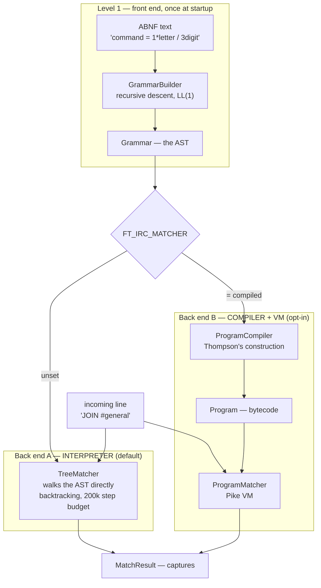
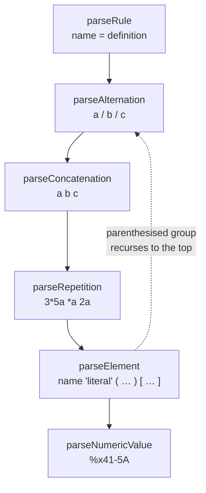
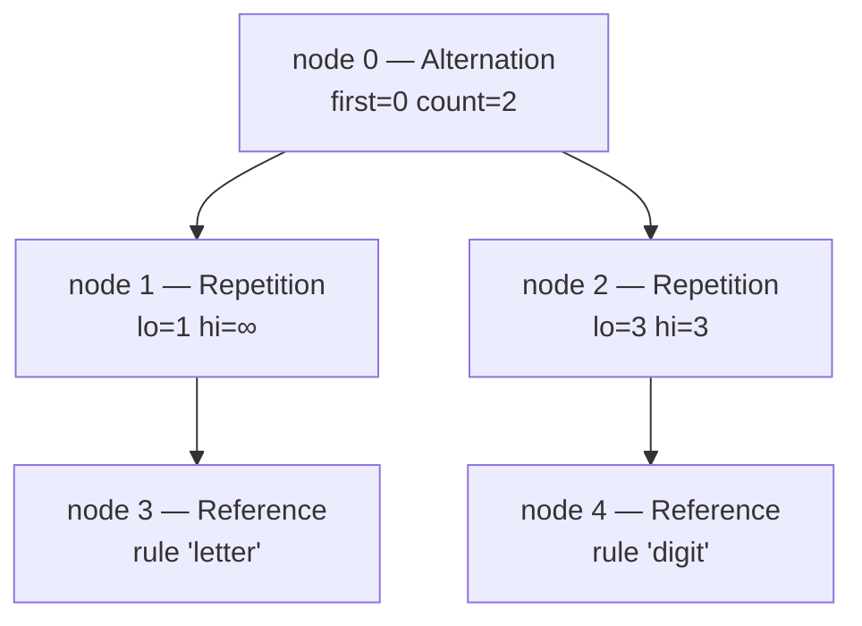
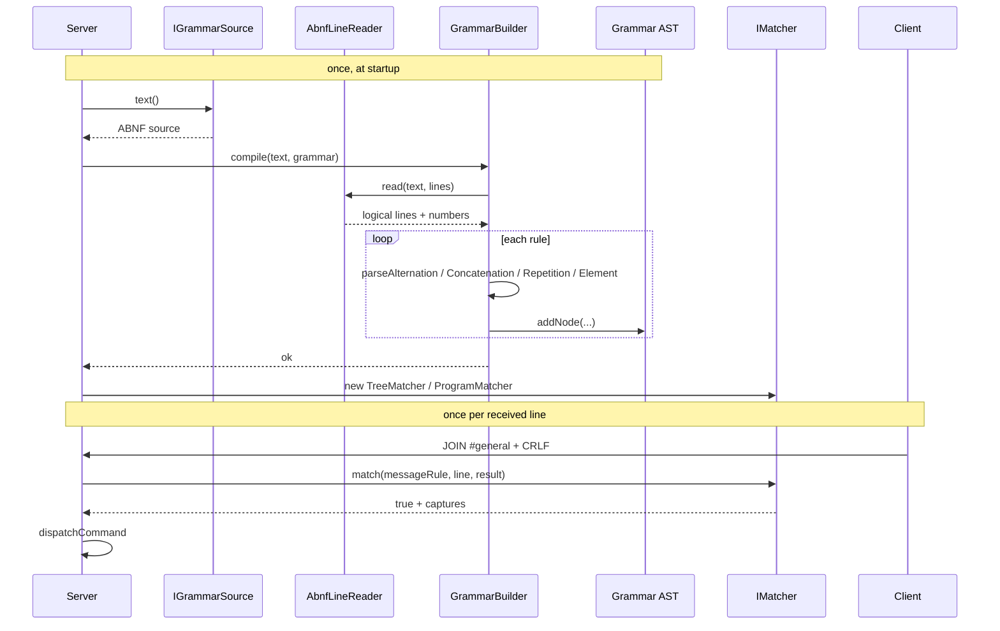

# The grammar subsystem — scanner, parser, AST, two matchers

*What the pieces in `src/grammar/` are, and what they are called in the
literature.*

---

## The short answer to "what is this architecture called?"

`src/grammar/` is a small but complete **language implementation**: one **front
end** and **two back ends**. Calling the whole thing "a compiler" is wrong, and
so is calling it "an interpreter" — it is both, and which one runs is a
runtime choice.

| Part | What it is called |
| --- | --- |
| ABNF text → AST | a **front end**; its parser is a **scannerless recursive-descent parser**, i.e. hand-written **LL(1)** |
| AST → match, walking the tree | a **tree-walking interpreter** — `TreeMatcher`, **the default** |
| AST → bytecode → match | an **AOT compiler + virtual machine** — `ProgramCompiler` + `ProgramMatcher`, opt-in |

The term **LL**, which comes up whenever this kind of parser is discussed,
belongs to the first row only:

- **LL** = read input **L**eft-to-right, build a **L**eftmost derivation.
- **(1)** = one character of lookahead is enough to decide what to do next.
- **Recursive descent** = one function per grammar construct, calling each
  other, using the C++ call stack as the parser stack.
- **Scannerless** = there is no separate tokenizer; the parser works directly
  on characters.

The other family is **LR** (bottom-up, table-driven — what `yacc`/`bison`
generate). LL is top-down and readable by hand; LR is more powerful but you
generally do not write one by hand. ft_irc is LL.

Having an interpreter and a compiler for the same AST, behind one interface, is
an ordinary and deliberate arrangement — the same shape as CPython's evaluator
next to a JIT, or a debug interpreter next to an optimising backend. Here the
interpreter is the general one and the compiler is the fast-but-restricted one,
which is the opposite of the usual trade and is explained in Stage 5.

- **LL** = read input **L**eft-to-right, build a **L**eftmost derivation.
- **(1)** = one character of lookahead is enough to decide what to do next.
- **Recursive descent** = one function per grammar construct, calling each
  other, using the C++ call stack as the parser stack.
- **Scannerless** = there is no separate tokenizer; the parser works directly
  on characters.

The other family you may have heard of is **LR** (bottom-up, table-driven —
what `yacc`/`bison` generate). LL is top-down and readable by hand; LR is more
powerful but you generally do not write one by hand. ft_irc is LL.

---

## The two levels — the thing that confuses everybody

Two different things get "compiled" here, and mixing them up is the usual
source of confusion. Note also that **level 2 is optional** — the default path
skips it entirely and interprets the AST directly.



- **Level 1** parses *the grammar itself*. Its input is ABNF source text. This
  is the part that is LL / recursive descent.
- **Level 2** turns that grammar into bytecode. Covered in
  [THOMPSON-NFA.md](THOMPSON-NFA.md).
- **Level 3** matches *actual IRC traffic* against the bytecode.

So when someone asks "is the IRC parser LL?" the honest answer is: the parser
that reads the **grammar** is LL. The thing that matches **IRC lines** is not a
parser in that sense at all — it is either a tree-walking interpreter or an
automaton simulation, depending on which back end is live.

---

## Classical compiler phases, and where each one lives

Textbooks split a front end into these phases. Here is the honest mapping —
including the one phase ft_irc does *not* have as a separate component.

| Textbook phase | In ft_irc | File |
| --- | --- | --- |
| Source input | `IGrammarSource` | `EmbeddedGrammarSource.cpp`, `FileGrammarSource.cpp` |
| Line handling / comment stripping | `AbnfLineReader` | `src/grammar/AbnfLineReader.cpp` |
| **Lexical analysis** (scanner/tokenizer) | *— none —* folded into the parser | |
| **Syntax analysis** (parser) | `GrammarBuilder` | `src/grammar/GrammarBuilder.cpp` |
| **AST** | `Grammar` + `GrammarNode` | `src/grammar/Grammar.cpp` |
| **Semantic analysis** | `GrammarValidator` | `src/grammar/GrammarValidator.cpp` |
| **Code generation** | `ProgramCompiler` | `src/grammar/compiled/ProgramCompiler.cpp` |
| Execution — interpreter | `TreeMatcher` (tree-walking) | `src/grammar/interpreted/TreeMatcher.cpp` |
| Execution — VM | `ProgramMatcher` (Pike VM) | `src/grammar/compiled/ProgramMatcher.cpp` |

### On the missing lexer

Most compilers have a scanner that turns `1*letter` into a token stream
`NUMBER(1) STAR IDENT(letter)`, and a parser that consumes tokens. ft_irc skips
that: `GrammarBuilder` walks the raw string with an index (`std::size_t& i`)
and reads characters directly.

That is a legitimate design called **scannerless parsing**. It is a good fit
here because ABNF's lexical structure is trivial — the interesting decisions
are all syntactic. `AbnfLineReader` does the *only* pre-pass that is worth
separating: strip `;` comments and fold continuation lines, so the parser sees
one complete rule per string.

---

## Stage 1 — `AbnfLineReader`

Input: the whole grammar file as one string. Output: a vector of
`{ text, number }`, one entry per logical rule.

It handles the three things ABNF does across physical lines:

- `;` starts a comment that runs to end of line
- an **indented continuation line** belongs to the rule above it, so
  `*8( letter )` on its own indented line folds up into the previous rule
- `=/` is ABNF's **incremental alternative**: `x =/ "b"` adds an alternative to
  an existing `x` rather than redefining it, so it must not be folded like a
  plain continuation (`AbnfLineReader.cpp:58`)

Keeping the line **number** alongside the text is what lets every later error
say *which line* — `grammar: line 12: …`.

---

## Stage 2 — `GrammarBuilder`, the recursive-descent parser

This is the LL parser. The shape to recognise: **one function per precedence
level**, each calling the next-tighter one in a cascade.



Read the cascade top-down and it *is* the precedence table:

- alternation `/` binds loosest, so it is outermost
- concatenation binds tighter than `/`
- repetition `*` binds tighter still
- an element is a name, a literal, a numeric range, or a bracketed group

The dotted arrow is the recursion: `( … )` sends you back to
`parseAlternation`, and that is the only reason this needs to be recursive at
all. Everything else is a loop.

**Why one character of lookahead is enough:** at each point, the next character
uniquely determines the branch — `%` means numeric value, `"` means literal,
`(` means group, `[` means optional, a digit or `*` means repetition, a letter
means a rule reference. No guessing, so no backtracking in the parser either.

Each `parseX` takes `(const std::string& s, std::size_t& i, int& out)` and
returns `bool`: it advances `i` past what it consumed, writes the node index to
`out`, and returns false with a message in `error()` on a syntax error.

---

## Stage 3 — `Grammar`, the AST

The AST is **not** a tree of pointers. It is a set of flat arrays, and nodes
refer to each other by integer index:

```cpp
std::vector<GrammarNode> _nodes;      // every node, in creation order
std::vector<int>         _children;   // child index lists, packed end to end
std::vector<std::string> _literals;   // interned literal text
std::vector<std::string> _captureNames;
std::vector<std::string> _ruleNames;
std::vector<int>         _ruleRoots;  // rule index -> root node index
```

A `GrammarNode` is one of six kinds — `Reference`, `Literal`, `OctetRange`,
`Sequence`, `Alternation`, `Repetition` — plus `first`/`count` pointing into
`_children`, and `lo`/`hi` doing double duty (repetition bounds, or byte range
bounds, or the referenced rule index).

This layout has names too: an **arena** (or **region**) allocator, and
**structure of arrays**. Why bother in C++98?

- Copying a `Grammar` is copying six vectors. No deep-copy walk, no ownership
  question, no leaks — the compiler-generated copy constructor is correct.
- No `new`/`delete` per node, so nothing to get wrong on an error path.
- Indices stay valid across a copy; raw pointers would not.

`1*letter / 3digit` lands in that structure like this:



---

## Stage 4 — `GrammarValidator`

Syntax being correct does not make a grammar usable. This is the **semantic
analysis** pass: it checks the things a parser structurally cannot. It rejects
two conditions.

**Undefined references** (`GrammarValidator.cpp:28`) — `rule 'x' is referenced
but never defined`. Nothing local to one rule can catch this; it needs the
whole grammar.

**Left recursion** (`GrammarValidator.cpp:119`) — and this one is worth
dwelling on, because it is *the* classic limitation of the LL family. A rule
like

```abnf
list = list "," item / item
```

is perfectly good notation, and an LR parser eats it happily. But ask a
recursive-descent parser to match `list`: the first thing it does is call
`list`, whose first act is to call `list`… That is infinite recursion, and it
is a stack overflow, not an error message.

LL parsers therefore cannot accept left-recursive grammars, and the standard
answer is to rewrite the rule right-recursively (`list = item *( "," item )`).
ft_irc does not attempt that rewrite automatically — it detects the condition
and refuses the grammar with a message naming the rule.

Splitting this out is deliberate: the parser stays a pure syntax reader, and
semantic errors get their own clear messages.

---

## Stage 5 — two matchers behind one interface

`IMatcher` is a **Strategy pattern**: two interchangeable implementations of
the same three-method interface (`match`, `strategy`, `lastExhausted`).

| | `TreeMatcher` | `ProgramMatcher` |
| --- | --- | --- |
| `strategy()` | `"interpreted/tree"` | `"compiled/pike"` |
| Technique | tree-walking interpreter, backtracking | Thompson NFA / Pike VM |
| Worst case | exponential, capped at 200 000 steps | linear, no cap |
| Recursive rules | yes | **no** — inlining cannot express them |
| Capture in `*( … )` | yes | **no** — one slot pair per loop |
| Default | **yes** | opt in: `FT_IRC_MATCHER=compiled` |

Selection happens once at startup (`Server.cpp:88`). The compiled path calls
`compileAll()` there, so an incompatible grammar fails at boot with a readable
reason rather than silently misbehaving on line 400.

This is the same relationship as a **tree-walking interpreter** versus a
**bytecode VM** in any language runtime — the tree walker is simpler and more
general, the VM is faster and more constrained.

---

## Stage 6 — `MatchResult`

What comes back from a successful match. Captures are stored two ways:

- **by name** — `field("channel")`, `count("channel")` for a repeated capture
- **in sequence** — the order they appeared, with an owner index each

`Message` (`src/Message.cpp`) is a thin view over this: `msg.command`,
`msg.params`, and `field()` accessors that forward to the `MatchResult`.

---

## End to end



---

## Reading order

1. `include/grammar/GrammarNode.hpp` — 33 lines, the whole AST vocabulary
2. `include/grammar/Grammar.hpp` — how nodes are stored
3. `src/grammar/GrammarBuilder.cpp` — the recursive-descent cascade
4. `src/grammar/interpreted/TreeMatcher.cpp` — the simple matcher
5. [THOMPSON-NFA.md](THOMPSON-NFA.md), then `ProgramCompiler.cpp` and
   `ProgramMatcher.cpp` — the fast one

Tests: `tests/test_grammarbuilder.cpp` (parser), `tests/test_treematcher.cpp`
(matching), and `tests/test_matcherdifferential.cpp` — which builds a
`TreeMatcher` and a `ProgramMatcher` over the same grammar, runs both across the
same inputs, and asserts they agree down to the individual captures. That is the
safety net for keeping two implementations: either they behave identically, or
the suite says which input separates them.
