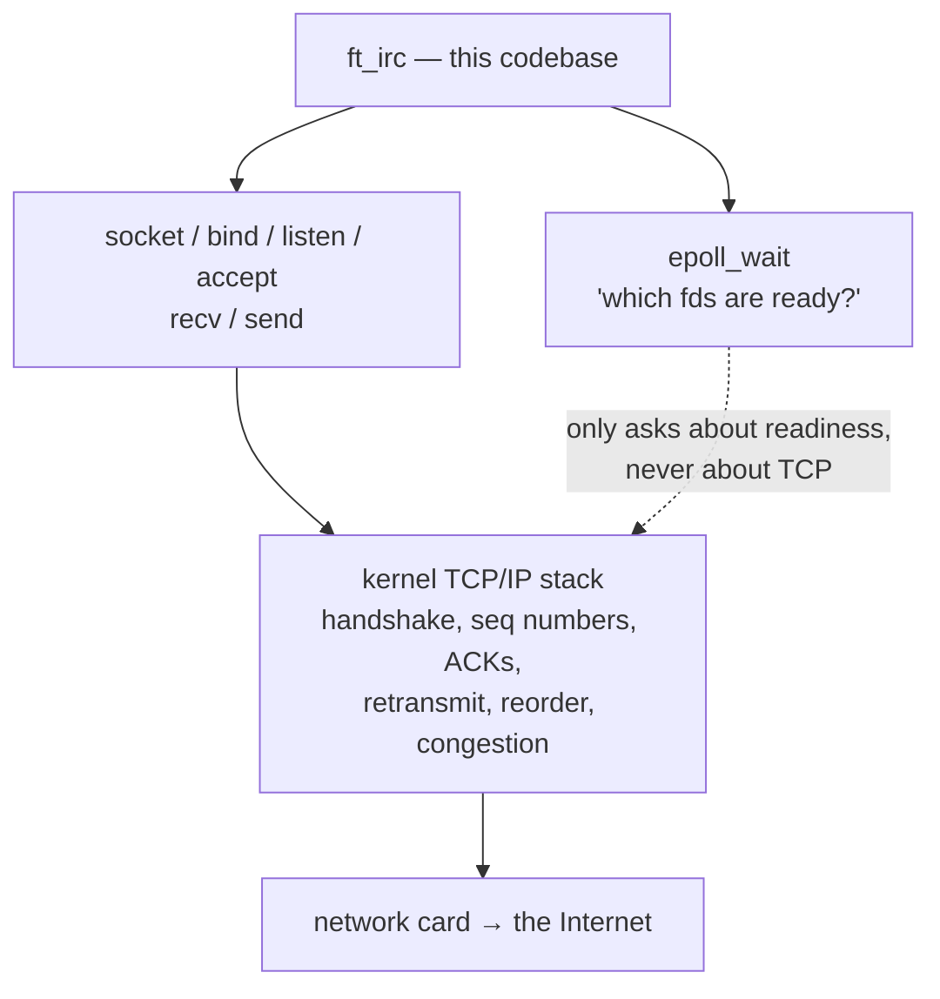
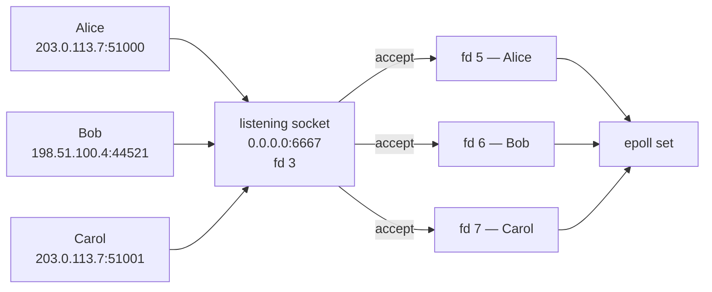
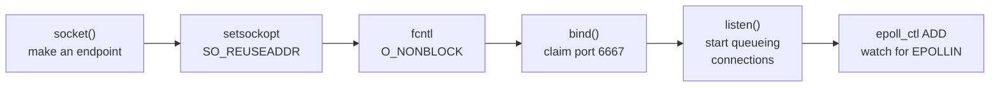
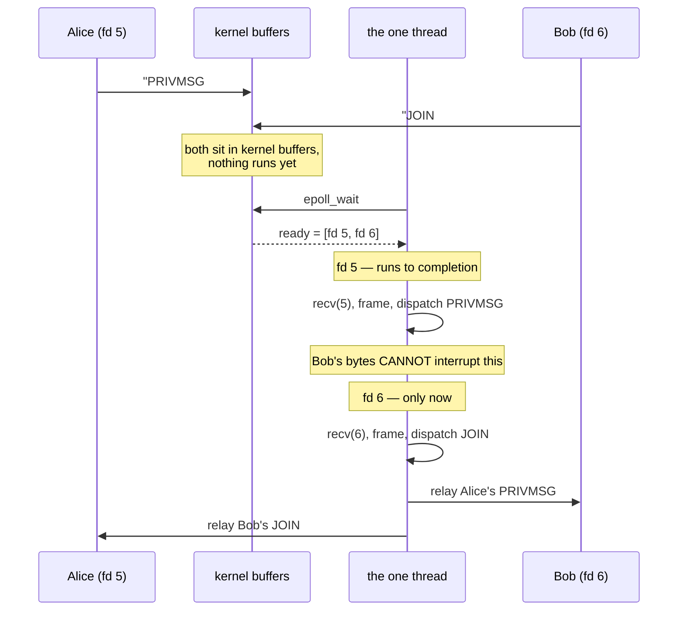
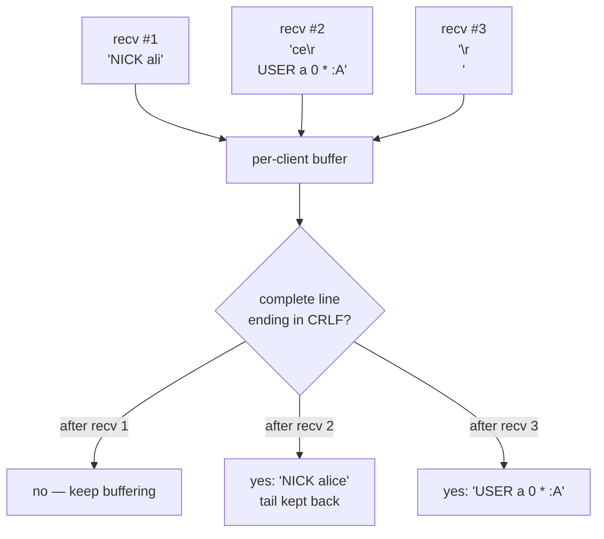
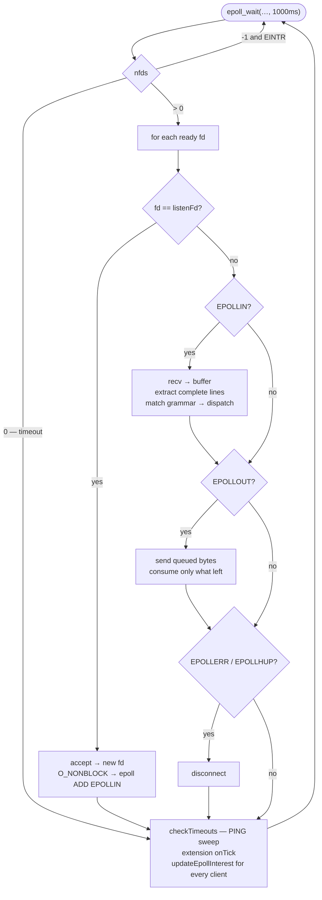

# Networking — one thread, many clients, no locks

*How `ft_irc` talks to several people on several machines at once, why nothing
races, and where TCP actually comes from.*

Anyone who has written a signal handler — 42's **minitalk**, say — learns
early that two things happening at once means race conditions and
`volatile sig_atomic_t`. This server handles hundreds of simultaneous
conversations and has **no locks, no atomics, and no threads**. This page
explains why that is not a contradiction.

---

## Part 1 — Where does TCP come from?

Short answer: **you ask for it explicitly, on one line, and `epoll` has nothing
to do with it.**

```c
_listenFd = socket(AF_INET, SOCK_STREAM, 0);   // src/Server.cpp:225
//                 ^^^^^^^  ^^^^^^^^^^^
//                 IPv4     THIS is what selects TCP
```

| Argument | Meaning |
| --- | --- |
| `AF_INET` | IPv4 addressing (`AF_INET6` for IPv6) |
| `SOCK_STREAM` | **a reliable ordered byte stream → TCP** |
| `SOCK_DGRAM` | would be datagrams → UDP |
| `0` | "the default protocol for that combination", i.e. `IPPROTO_TCP` |

From that call on, the kernel runs the entire TCP state machine for you:
handshakes, sequence numbers, acknowledgements, retransmission of lost packets,
reordering, congestion and flow control. **None of that is in this codebase**,
and none of it is in `epoll`.

### So what is epoll, then?

`epoll` is a **readiness notifier**. It answers exactly one question:

> Of all these file descriptors I am watching, which ones can I touch right now
> without blocking?

That is all. It does not know what a descriptor *is*. The same `epoll` works on
pipes, terminals, timers, signal fds, and UDP sockets. It has no opinion about
TCP whatsoever.



### What TCP gives you — and the one thing it does not

TCP guarantees your bytes arrive, **in order**, or the connection dies trying.
What it does **not** give you is **message boundaries**.

TCP is a *byte stream*, not a message queue. If a client sends:

```
NICK alice\r\nUSER alice 0 * :Alice\r\n
```

your `recv()` may legitimately return any of these:

- the whole thing at once
- `NICK alice\r\nUSER ali` — then the rest later
- `N`, then `ICK alice\r\n…` one byte at a time

All three are correct TCP behaviour. **Reassembling messages is your job**, and
that is precisely why IRC terminates every line with `\r\n` and why this server
has a `LineBuffer`. See Part 7.

---

## Part 2 — Many computers, one server: how the kernel tells them apart

A TCP connection is identified by a **4-tuple**:

```
(source IP, source port, destination IP, destination port)
```

Every client connecting to your port 6667 shares the same *destination* pair,
but each has a different source. That is what makes them distinguishable — even
two clients behind the same router, even the same person opening two windows.

There are therefore **two different kinds of socket**:

| Socket | Made by | Job |
| --- | --- | --- |
| **Listening** socket, `_listenFd` | `socket()` + `bind()` + `listen()` | Never carries data. Only produces new connections. |
| **Connection** socket, one per client | `accept()` | Carries the bytes for exactly one client. |

`accept()` (`Server.cpp:308`) takes a pending connection off the queue and
returns a **brand-new file descriptor** for it. That fd goes into the map and
into epoll:

```c
_clients[clientFd] = client;
addToEpoll(clientFd, EPOLLIN);          // Server.cpp:334
```



Note Alice and Carol share an IP — same machine, two clients. Different source
ports, so different connections, different fds. The loop never has to care
where anyone is.

---

## Part 3 — Bringing the listener up

Four calls, in order (`Server.cpp:225-244`):



**`SO_REUSEADDR`** deserves a note, because without it you meet a confusing
bug. When a TCP connection closes, the kernel keeps the port in `TIME_WAIT` for
a couple of minutes to catch stray packets from the old connection. Restart your
server in that window and `bind()` fails with *"Address already in use"* even
though nothing is running. `SO_REUSEADDR` says "I accept that risk, give me the
port" — which is what you want during development.

**`listen(_listenFd, SOMAXCONN)`** — `SOMAXCONN` is the backlog: how many
finished-but-not-yet-`accept()`ed connections the kernel will hold for you. It
is a queue depth, not a client limit. The real limit is checked separately:

```c
if (_clients.size() >= settings().maxClients) { close(clientFd); ... }
```

---

## Part 4 — Why there is no data race

This is the heart of it, and the part that surprises people most.

### What made minitalk racy

In minitalk, `SIGUSR1` arrives **asynchronously**. The kernel can deliver it
between *any two machine instructions* of your program. Your main code is
halfway through updating a variable; the handler fires, sees a half-updated
value, and corrupts it. That is **preemption**, and it is a genuine race —
hence `volatile sig_atomic_t` and the tiny list of async-signal-safe functions.

### Why this server is different

There is **one thread**, and **nothing interrupts it**. `epoll_wait` hands back
a batch of ready descriptors, and the loop processes them **one at a time, each
to completion**:

```c
for (int i = 0; i < nfds; ++i) {          // Server.cpp:278
    int fd = events[i].data.fd;
    if (fd == _listenFd)          acceptClient();
    else if (_clients.count(fd)) {
        if (ev & EPOLLIN)  handleClientInput(fd);
        if (ev & EPOLLOUT) handleClientOutput(fd);
    }
}
```

While `handleClientInput(5)` runs for Alice, Bob's bytes **cannot** appear
mid-function. They sit in a kernel receive buffer until the loop comes back
round and reaches fd 6. Alice's handler always sees consistent state, because
nothing else is allowed to run.

> **Concurrency is not parallelism.** Many conversations are *in flight*
> (concurrency). Exactly one instruction executes at a time (no parallelism).
> Locks exist to protect against parallelism. There is none, so there is
> nothing to lock.



### The one thing that *does* bite

No data races — but plenty of **lifetime** hazards. A handler can disconnect a
client, so a pointer you were holding becomes dangling. The loop is written
defensively about exactly this, and it is worth seeing:

```c
if (ev & EPOLLIN)  handleClientInput(fd);
if ((ev & EPOLLOUT) && _clients.count(fd)) handleClientOutput(fd);
//                     ^^^^^^^^^^^^^^^^^^ input may have just deleted it
```

and inside the message loop (`Server.cpp:362`):

```c
std::map<int, Client*>::iterator cit = _clients.find(fd);
if (cit == _clients.end() || cit->second->isPendingClose()) return;
```

A single batch from one `recv()` can contain `QUIT` followed by more commands.
After `QUIT`, the client is gone — so the loop rechecks before continuing.
**This is the real hazard class in an event loop**, and it replaces the race
conditions you fought in minitalk.

---

## Part 5 — Why every socket is non-blocking

Both the listener (`Server.cpp:232`) and every accepted client
(`Server.cpp:317`) get:

```c
fcntl(fd, F_SETFL, O_NONBLOCK);
```

Consider what a *blocking* `recv()` would mean here. One thread serves
everybody. If it blocks waiting for Alice — who opened a connection and typed
nothing — then **Bob, Carol and everyone else are frozen** until Alice presses a
key. One idle client would freeze the server.

Non-blocking means every call returns immediately: with data, or with `-1` and
`errno == EAGAIN` meaning "nothing right now". Combined with epoll — which only
tells you about fds that are *already* ready — the thread never waits on any
single client.

> The 42 subject allows `fcntl` **only** as `F_SETFL, O_NONBLOCK`, and forbids
> every other flag. `scripts/audit.sh` enforces this.

---

## Part 6 — The event loop, line by line

```c
while (isRunning) {
    int nfds = epoll_wait(_reactor.fd(), events, MAX_EVENTS, 1000);
    if (nfds < 0) {
        if (errno == EINTR) continue;      // a signal woke us — not an error
        throw std::runtime_error(...);
    }

    for (int i = 0; i < nfds; ++i) { /* dispatch, as above */ }

    checkTimeouts();                       // PING sweep / idle clients
    checkPendingCloseTimeouts();
    for (...) _extensions[i]->onTick(*this, now);
    for (...) updateEpollInterest(it->second);
}
```

Three details that are easy to miss:

**The `1000` is a timeout in milliseconds.** Without it, a completely idle
server would sleep forever in `epoll_wait` and never run its PING sweep. The
timeout guarantees the loop turns at least once a second even with zero traffic,
so timeouts and extension ticks still happen.

**`EINTR` is not a failure.** A signal (`SIGINT`, a debugger attaching) makes
`epoll_wait` return early with `errno == EINTR`. The correct response is to go
round again, not to die.

**`EPOLLERR | EPOLLHUP`** means the peer vanished or the connection broke.
Neither is readable nor writable in a useful way, so it goes straight to
disconnect.

| Event | Meaning | Handler |
| --- | --- | --- |
| `EPOLLIN` on `_listenFd` | a new client is waiting | `acceptClient()` |
| `EPOLLIN` on a client | bytes arrived, `recv` will not block | `handleClientInput()` |
| `EPOLLOUT` on a client | kernel send buffer has room | `handleClientOutput()` |
| `EPOLLERR` / `EPOLLHUP` | broken or hung up | `disconnectClientNow()` |

---

## Part 7 — Reading: TCP is a stream, framing is yours

```c
ssize_t bytesRead = recv(fd, buf, Limits::kMsgLen, 0);
if (bytesRead <= 0) {
    if (bytesRead == 0) disconnectClient(fd, "Connection closed");
    return;                                  // Server.cpp:347
}
client->appendToRecvBuffer(std::string(buf, bytesRead));
std::vector<std::string> messages = client->extractMessages();
```

**`recv() == 0` means orderly shutdown** — the peer closed. It is not an error
and not "no data" (that would be `-1` with `EAGAIN`). It is end-of-stream.

Everything received is appended to a per-client buffer, and `extractMessages()`
pulls out only the **complete** lines, leaving any partial tail buffered for the
next event. That is `libcpp98::BufferedSocket` wrapping `LineBuffer`.



`LineBuffer` also enforces the 512-byte RFC limit as an **invariant**: an
over-long line is truncated *and its remainder discarded up to the terminator*,
so a peer cannot smuggle a command through by prefixing it with padding.

---

## Part 8 — Writing: partial writes and slow clients

Sending has the mirror-image problem. `send()` may accept **fewer bytes than you
gave it** when the kernel's send buffer is full — typically because the client
is on a slow link and is not reading fast enough.

```c
ssize_t bytesSent = send(fd, buf.c_str(), buf.size(), 0);
if (bytesSent < 0) return;
client->clearSendBuffer(bytesSent);          // consume ONLY what went out
```

So the server never assumes a write completed. Unsent bytes stay queued, and
the rest goes out on the next `EPOLLOUT`.

### The mask is dynamic — and it must be

```c
uint32_t want = (client->isPendingClose() ? 0u : EPOLLIN)
              | (client->hasPendingData() ? EPOLLOUT : 0u);
if (it != _epollMask.end() && it->second == want) return;   // skip a syscall
modifyEpoll(fd, want);                                      // Server.cpp:415
```

**Why not just always watch `EPOLLOUT`?** Because a socket with an empty send
buffer is *always* writable. Subscribing permanently would make `epoll_wait`
return instantly, forever, burning 100% CPU on nothing. This is the classic
event-loop beginner bug. So `EPOLLOUT` is requested **only while there is
something queued**, and dropped the moment the queue empties.

The `_epollMask` cache means the loop only issues an `epoll_ctl` syscall when
the mask actually *changes*, not once per client per turn.

### Backpressure

If a client is so slow that its queue keeps growing, the server does not buffer
forever — that would be a memory-exhaustion attack. Past the SendQ limit the
client is dropped (`isSendQExceeded()`). The file-transfer extension is polite
about the same limit, pausing rather than dropping:

```c
if (recipient->getSendBuffer().size() > settings().sendQ / 2) {
    notice(server, client, "FILE WAIT " + msg.params[1]);
    return;
}
```

---

## The whole picture



---

## Where the code is

| Concern | Location |
| --- | --- |
| socket / bind / listen | `src/Server.cpp:225-244` |
| epoll wrapper (checked `epoll_ctl`) | `vendor/libcpp/c98/src/reactor.cpp` |
| the event loop | `src/Server.cpp:264` |
| accept a client | `src/Server.cpp:304` |
| read + frame | `src/Server.cpp:341`, `Client::extractMessages` |
| write + partial writes | `src/Server.cpp:369` |
| dynamic epoll mask | `src/Server.cpp:412` |
| line framing, send queue | `vendor/libcpp/c98/src/line_buffer.cpp`, `buffered_socket.cpp` |

Watch it happen:

```bash
FT_IRC_LOG=trace ./ircserv 6667 pass
```

Open two clients and you will see the interleaving from Part 4 — `fd 5` and
`fd 6` alternating, never overlapping.

**See also:** [GRAMMAR-ARCHITECTURE.md](GRAMMAR-ARCHITECTURE.md) — what happens
to a line *after* framing. [LOGGING.md](LOGGING.md) — reading the trace output.
