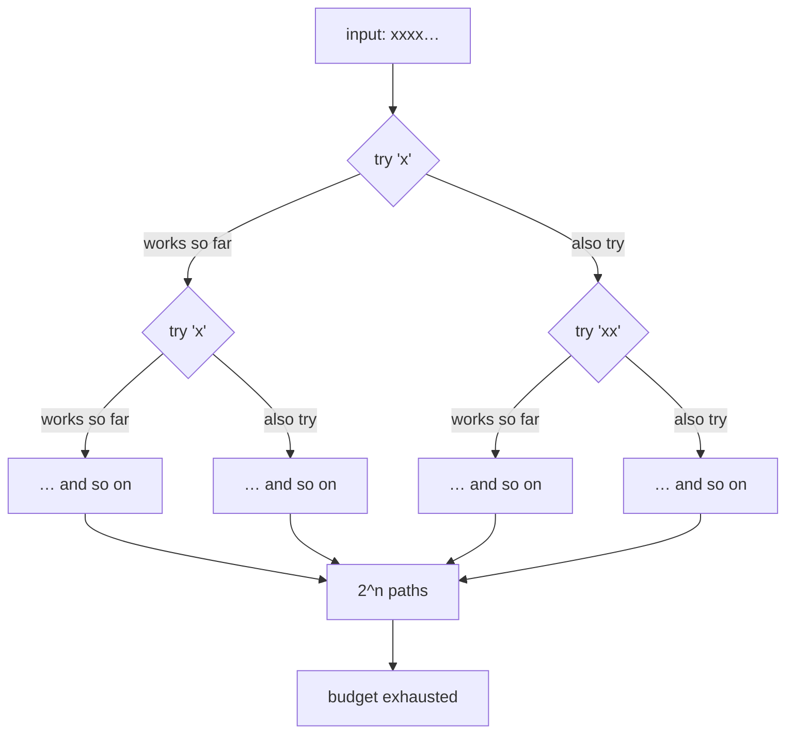
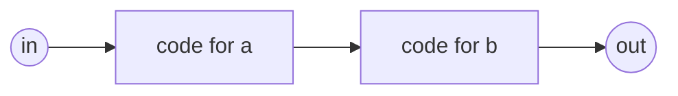
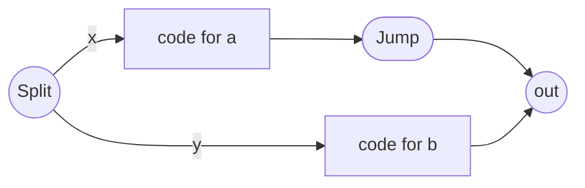
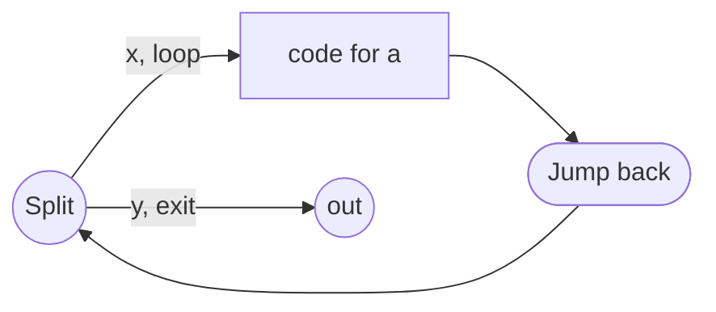
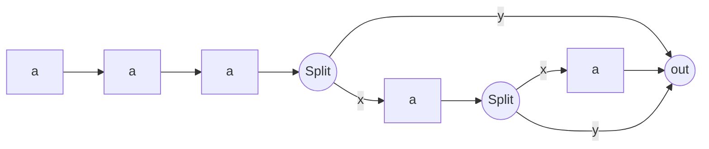
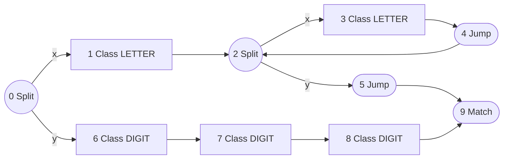
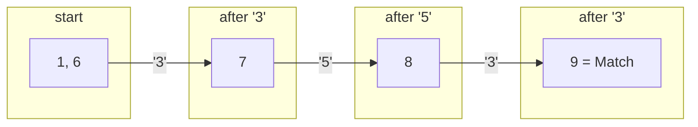

# How the matcher works — Thompson's construction and the Pike VM

*A beginner's guide to the thing `FT_IRC_MATCHER=compiled` turns on.*

If you have ever wondered what the log line `grammar: … -> compiled/pike` is
talking about, this page is for you. No prior compiler knowledge assumed.

---

## 1. The problem

ft_irc does not hand-write a parser for `JOIN`, `PRIVMSG`, `MODE` and the rest.
It reads the grammar of RFC 2812 as **ABNF** text — the same notation the RFC
itself is written in — and matches incoming lines against it:

```abnf
command    =  1*letter / 3digit
```

Read aloud: *a command is either one-or-more letters, or exactly three digits.*
(`NICK` is the first form; `353` is the second.)

So the question is: **given that rule and the text `353`, does it match?**

---

## 2. The obvious way, and why it hurts

The obvious way is to try the alternatives one at a time and back up when one
fails. Try `1*letter` — `3` is not a letter, fail, back up — try `3digit` —
works. That is called **backtracking**, and ft_irc has a matcher that does
exactly this (`TreeMatcher`, the default).

It is simple and it works. But it has a nasty failure mode. Consider:

```abnf
bad = *( "x" / "xx" )
```

On a line of 400 `x` characters, the matcher must try *every combination* of
"take one x" and "take two x" before concluding anything. The number of
combinations doubles with every character. That is **exponential blowup**, and
it is a real denial-of-service vector: one short line, and the server is busy
for the rest of the afternoon.

`TreeMatcher` defends itself with a hard budget — 200 000 node visits, then it
gives up (`TreeMatcher.cpp:8`). That works, but "give up" is not the same as
"answer".



---

## 3. Thompson's idea

In 1968 Ken Thompson published the fix, and it is beautifully simple:

> **Don't pick one alternative. Follow all of them at the same time.**

Instead of "try `1*letter`, and if that fails back up and try `3digit`", you
keep a **set of positions you might currently be at**, and you advance the
whole set by one character at a time.

Because it is a *set*, duplicates collapse. That single fact is what turns
exponential into linear — we will come back to it in §7.

The data structure holding "all the places you might be" is called an **NFA**
(nondeterministic finite automaton). "Nondeterministic" just means *it is
allowed to be in several states at once* — which is precisely what we want.

---

## 4. The instruction set

ft_irc does not build an NFA out of objects and pointers. It compiles the
grammar into a tiny **bytecode program**, and the "NFA states" are just
instruction addresses. There are exactly five instructions
(`include/grammar/compiled/Program.hpp`):

| Op | Meaning |
| --- | --- |
| `Class x` | Consume one byte, if it is in bitmap `x`. Otherwise this path dies. |
| `Split x, y` | **Fork.** Continue at `x` *and* at `y`, both. |
| `Jump x` | Continue at `x`. |
| `Save x` | Record "capture slot `x` starts/ends here". Consumes nothing. |
| `Match` | This path has reached the end of the rule. |

`Split` is the whole trick. It is the instruction that lets one program be in
two places at once.

Note what is **not** here: no "try this, and on failure rewind". Nothing ever
rewinds. There is no stack.

---

## 5. Thompson's construction

"Thompson's construction" is the recipe for turning each grammar operator into
these instructions. Each rule becomes a block of code with one entry point and
one exit, so blocks nest freely.

### Concatenation — `a b`

Just emit one after the other. Nothing clever.



### Alternation — `a / b`

Fork, run one branch, jump over the other.



Source: `ProgramCompiler.cpp:246`.

### Repetition, unbounded — `*a`

Fork between "go round again" and "leave". The `Jump` at the bottom sends you
back to the same `Split`.



Source: `ProgramCompiler.cpp:152`.

### Repetition, bounded — `3*5a`

There is no counter register in this VM, so bounded repetition is
**unrolled**: emit the 3 mandatory copies, then 2 optional ones each guarded by
its own `Split` that can jump straight to the end.



Unrolling has a cost, so there is a cap: `*14(x)` unrolls fine, `*999(x)` is
refused (`ProgramCompiler.cpp:162`).

---

## 6. A complete worked example

Take the real rule from the top of this page:

```abnf
command = 1*letter / 3digit
```

Compiled, it becomes exactly this program:

```
 0:  Split 1, 6        ; alternation: branch A at 1, branch B at 6
 ---- branch A: 1*letter -------------------------------
 1:  Class LETTER      ; the mandatory first letter
 2:  Split 3, 5        ; loop: another letter (3), or done (5)
 3:  Class LETTER
 4:  Jump 2            ; back to the loop head
 5:  Jump 9            ; branch A finished, skip over branch B
 ---- branch B: 3digit ---------------------------------
 6:  Class DIGIT       ; unrolled: exactly three, no loop
 7:  Class DIGIT
 8:  Class DIGIT
 ---- both branches land here --------------------------
 9:  Match
```

As a picture:



---

## 7. Running it

The VM keeps a **thread list**. A "thread" here is nothing to do with the
operating system — it is just a pair *(program counter, capture slots)*. All
threads advance in lockstep, one input byte per step.

Two lists are used: `current` (threads at this position) and `next` (threads
that survived this byte). See `ProgramMatcher::match`.

Let us run `353` against the program above.

**Setup.** Add thread at pc 0. `Split`, `Jump` and `Save` are followed
*immediately* — they consume no input — so adding pc 0 really adds pc 1 and
pc 6. The list only ever holds `Class` and `Match` threads.

> `current = [1, 6]`

**Byte 0 — `'3'`**

| thread | instruction | outcome |
| --- | --- | --- |
| pc 1 | `Class LETTER` | `'3'` is not a letter → **dies** |
| pc 6 | `Class DIGIT` | `'3'` is a digit → advance to pc 7 |

> `current = [7]`

**Byte 1 — `'5'`** → pc 7 accepts, advance to pc 8. → `current = [8]`

**Byte 2 — `'3'`** → pc 8 accepts, advance to pc 9. → `current = [9]`

**End of input.** pc 9 is `Match`, and we are at position 3 of a 3-byte line,
so the whole line was consumed. **Accept.**



Notice branch A died on the very first byte and was never revisited. No
backtracking happened, because there was nothing to back up *to*.

### The whole-line rule

`Match` only accepts when `pos == length` (`ProgramMatcher.cpp:120`). A thread
that reaches `Match` early has matched a **prefix**, which is not good enough —
`JOIN #a junk` must not be accepted as a valid `JOIN`.

### Why it is linear

This is the punchline. In `addThread`:

```cpp
if (seen[index] == generation) return;  // one thread per pc per step
```

Each program counter may appear **at most once** in the list at any given
position. If two different paths arrive at the same instruction at the same
byte, they are the same situation from here on, so the second is dropped.

The list can therefore never be longer than the program. With `P` instructions
and `N` input bytes, the work is bounded by **P × N** — linear in the length of
the line, always, with no budget and no cliff.

`generation` is a cheap way to clear the `seen` array: instead of zeroing it
every step, bump a counter and compare against that.

### Is this a DFA? No — and it could not be

A very common question, because "linear-time matching" and "DFA" get used as
if they were the same thing. They are not.

| | DFA | What this VM does |
| --- | --- | --- |
| States held at once | exactly **one** | a **set** — the thread list |
| Transitions | precomputed table, `state × byte → state` | computed on the fly by `addThread` |
| Build cost | can be **exponential** in the NFA size | linear — it is just the bytecode |
| Captures | **impossible** | yes, via `Save` slots |

You *can* turn an NFA into a DFA. The recipe is called **subset construction**,
and the idea is exactly the thread list: each DFA state *is* one of the sets of
NFA states you might be in. Precompute every reachable set, and you get a table
you can drive one lookup per byte.

The catch is in the word "every". With `P` instructions there are up to `2^P`
subsets, so the table can explode. Engines that do want a DFA (grep, RE2) build
it **lazily** — construct each subset the first time input actually reaches it,
and cache it. ft_irc does not do this; it recomputes the set per byte, which
costs a little more per byte and nothing at all up front.

The decisive reason, though, is the last row of that table. **A DFA cannot
report captures.** Collapsing many NFA states into one DFA state is precisely
an act of forgetting *which* path you took to get there — and "which path" is
the only thing that can tell you where `<channel>` started and ended. A DFA can
answer "does this line match `JOIN`?" It cannot answer "and what channel?",
which is the entire reason ft_irc runs a matcher at all.

That is why the design is a Pike VM and not a DFA: the per-thread slot arrays
are the memory a DFA deliberately throws away.

---

## 8. Captures

Matching yes/no is not enough — the server needs *the channel name*. That is
what `Save` is for. Each captured element gets a slot pair: `Save 2k` before it
records the start offset, `Save 2k+1` after it records the end
(`ProgramCompiler.cpp:232`).

Because threads run in parallel, each thread carries its **own** copy of the
slots, and `Save` copies-on-write via `cloneSlots`. When a thread reaches
`Match`, its slot array is the answer, and the substrings are cut out of the
line.

An NFA simulation carrying capture slots like this has a name too: a **Pike
VM**, after Rob Pike. Hence `strategy()` returning `"compiled/pike"`.

---

## 9. What it refuses to compile

The compiled path is deliberately not universal. Two rules are rejected with a
clear message rather than mis-matched:

- **Recursive rules.** The compiler inlines rule references, so a rule that
  refers to itself would inline forever (`ProgramCompiler.cpp:217`).
- **A capture inside an unbounded repetition** — `*( $x )`. The loop reuses one
  slot pair, so only the last repetition would survive. Give the repetition an
  upper bound and it unrolls into distinct slots
  (`ProgramCompiler.cpp:146`).

This is why `TreeMatcher` remains the default: it handles both, at the cost of
the budget. The compiled matcher is opt-in via `FT_IRC_MATCHER=compiled`, and
`compileAll()` fails loudly at startup rather than at the first bad line
(`Server.cpp:88`).

---

## 10. Where the code is

| Stage | File |
| --- | --- |
| Instruction set, class bitmaps | `include/grammar/compiled/Program.hpp` |
| Thompson's construction | `src/grammar/compiled/ProgramCompiler.cpp` |
| The VM (thread lists, `addThread`) | `src/grammar/compiled/ProgramMatcher.cpp` |
| The backtracking alternative | `src/grammar/interpreted/TreeMatcher.cpp` |

Try it:

```bash
FT_IRC_MATCHER=compiled FT_IRC_LOG=debug ./build/bin/ircserv 6667 pass
# grammar: <embedded> -> compiled/pike, …
```

Further reading: Russ Cox, *Regular Expression Matching Can Be Simple And Fast*
— the article this implementation follows.

**See also:** [GRAMMAR-ARCHITECTURE.md](GRAMMAR-ARCHITECTURE.md) — where the
grammar comes from in the first place.
